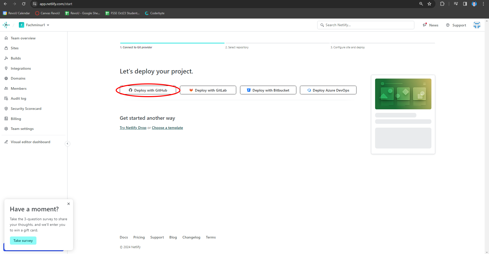

# Welcome to my project for RevoU assignment. 

## In this assignment, I am creating a website that consist of HTML and CSS file. The structure is build like this : 
- Header
  - Navigation bar

- Main
  - Sticky Nav bar
  - Product Section
  - Sign up section

**Here are the steps of creating them from scratch:**

## Building website from scratch by using HTML, CSS.

**1. Build the structure in HTML.**
> The first step is building the structure in HTML. This step important because the HTML is the core of this assignment. This is done by using VSCode to create the content of the website. The use of semantic HTML is also required.

**2. Create styling in CSS.**
>    After the creation of the core is completed, it is important to use styling in the CSS so people could use the website properly. There are several things need to be applied in CSS for this assignment, such as:
>>  - positioning contents
>>  - The use flex
>>  - The use media query

**3. Push to GitHub.**
>   After the creation of the website is done. The next step is to push the project to GITHUB as remote directory which we can access all the time. You can use these following commands in the terminal:
*git add .*
*git commit -m "yourmessage"*
*git push origin main*

##Deployment

**1. Login to Netlify**
> After pushing your project to GitHub, login to netlify is required to deploy the project. Login with github account to automatically sync netlify account to github account.

**2. Deploy the project.**
>    The next step is deploying the project from github to the web by using netlify.

